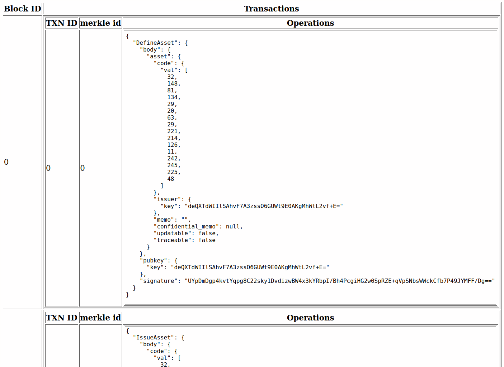

# Transaction Builder Command Line Interface

The `txn_builder_cli` application creates transactions and submits them to the ledger server. The typical workflow of P2P lending is as follows
* Create a new empty transaction. See `txn_builder_cli create_txn_builder`.
* Create new users. See `txn_builder_cli issuer sign_up`, `txn_builder_cli lender sign_up` and `txn_builder_cli borrower sign_up`.
* Borrower: adds or updates a credential record. See `txn_builder_cli borrower create_or_overwrite_credential`.
* Borrower: requests a loan. See `txn_builder_cli borrower request_loan`.
* Lender: fulfills the loan. See `txn_builder_cli lender fulfill_loan`.
* Borrower: loads funds. See `txn_builder_cli borrower load_funds`.
* Borrower: pays off the loan. See `txn_builder_cli borrower pay_loan`.
* Query the ledger with the transaction ID to see if the transaction was committed using a web browser or command line tool.

## Command help

To get documentation on a specific command, use the keyword help
followed by the the command. To get help on a subcommand, use help and
the command and subcommand.

For example, for help defining an asset

```
./txn_builder_cli help add define_asset
```

**Note**:
* Even if the subcommand is unique, it is still necessary to
supply the command name as well. This is true for both help and the
actual subcommands.
* By default, all the generated files will be stored in `~./findora`, unless specified otherwise. For example, if the current directory is `platform/target/debug`, running `./txn_builder_cli keygen` will put the generated key pair in ~./findora, but `./txn_builder_cli keygen --name keys/key_pair` will store the key pair to `platform/target/debug/keys/key_pair`.
* Examples below are assuming the current directory is `platform/target/debug`. If not, change `./txn_builder_cli` to the path to `./txn_builder_cli`.

## Submit a transaction
After a transaction is composed by `define_asset`, `issue_asset`, `transfer_asset`, or `issue_and_transfer_asset`:
```
./txn_builder_cli --txn tb submit
```
By default, `https://testnet.findora.org` is used. To switch to `http://localhost`, add `--http --localhost`.

## AssetIssuer account
### Sign up an AssetIssuer account
In the initial data, there's one AssetIssuer, Izzie. To sign up a new AssetIssuer account:
```
./txn_builder_cli asset_issuer sign_up --name 'Issuer Name'
```

### Define an asset
* Create an empty transaction
```
./txn_builder_cli create_txn_builder --name txn_define
```
* Define an asset
```
./txn_builder_cli --txn txn_define issuer --id 0 define_asset --memo 'Define an asset.'
```
By default, a randomly generated token code will be used. To specify a code, use `--token_code`.
To define a fiat asset, add `--fiat`.

* Submit the transaction
```
./txn_builder_cli --txn txn_define submit
```

### Issue units of an asset
After an asset is defined and the transaction is submitted:
* Create an empty transaction
```
./txn_builder_cli create_txn_builder --name txn_issue
```
* Issue the asset
```
./txn_builder_cli --txn txn_issue issuer --id 0 issue_asset --token_code ibIaBlHV-PdQkvSuEg6YSA== --amount 100
```
* Submit the transaction
```
./txn_builder_cli --txn txn_issue submit
```
To display the utxo sids, add `--get_sids`. To store the sids to a file, use `--sids_path`.

### Transfer units of an asset. See `txn_builder_cli add transfer_asset`.
After an asset is defined and issued, and transactions are submitted:
* Create an empty transaction
```
./txn_builder_cli create_txn_builder --name txn_transfer
```
* Transfer
```
./txn_builder_cli --txn txn_transfer issuer --id 0 transfer_asset --sids_path s recipients 0,1 --input_amounts 45 --output_amounts 10,35
```
* Submit the transaction
```
./txn_builder_cli --txn txn_transfer submit
```

### Issue and transfer units of an asset
After an asset is defined and the transaction is submitted:
* Create an empty transaction
```
./txn_builder_cli create_txn_builder --name txn_issue_and_transfer
```
* Issue and transfer the asset
```
./txn_builder_cli --txn txn_issue_and_transfer issuer --id 0 issue_and_transfer_asset --recipient 0 --amount 1000 --token_code ibIaBlHV-PdQkvSuEg6YSA==
```
Add `--confidential_amount` or `--confidential_asset` if needed.
* Submit the transaction
```
./txn_builder_cli --txn txn_issue_and_transfer submit
```
To get the utxo sids, add `--get_sids`.

## CredentialIssuer account
### Sign up a CredentialIssuer account
In the initial data, there's one CredentialIssuer, Ivy. To sign up a new CredentialIssuer account:
```
./txn_builder_cli credential_issuer sign_up --name 'Issuer Name'
```

## Lender account
### Sign up a lender account
In the initial data, there are two issuer, Lenny and Luna. To sign up a new lender account:
```
./txn_builder_cli lender sign_up --name 'Lender Name' --min_credit_score 570
```

### View loans
* View all loans of a lender
```
./txn_builder_cli lender --id 0 view_loan
```
* View a specific loan
```
./txn_builder_cli lender --id 0 view_loan --loan 0
```
Make sure the specified loan is owned by the lender.
* View loans with a filter
To filter the loans, add `--filter` with one of the following:
  * `requested`: loans that have been requested but not fulfilled
  * `fulfilled`: loans that have been fulfilled, either paid off or not
  * `declined`: loans that have been declined
  * `active`: loans that have been fulfilled but not paid off
  * `complete`: Loans that have been paid off
For example:
```
./txn_builder_cli lender --id 0 view_loan --filter active
```

### Fulfill a loan
* Create an empty transaction
```
./txn_builder_cli create_txn_builder --name txn_fulfill
```
* Fulfill the loan
```
./txn_builder_cli --txn txn_fulfill lender --id 0 fulfill_loan --loan 0 --issuer 0
```
By default, `https://testnet.findora.org` is used. To switch to `http://localhost`, add `--http --localhost`.

## Borrower account
### Sign up a borrower account
In the initial data, there's one borrower, Ben. To sign up a new borrower account:
```
./txn_builder_cli borrower sign_up --name 'Borrower Name'
```

### Load funds
* Create an empty transaction
```
./txn_builder_cli create_txn_builder --name txn_load
```
* Load funds
```
./txn_builder_cli --txn txn_load borrower --id 0 load_funds --issuer 0 --amount 500
```
By default, `https://testnet.findora.org` is used. To switch to `http://localhost`, add `--http --localhost`.

### View loans
* View all loans of a borrower
```
./txn_builder_cli borrower --id 0 view_loan
```
* View a specific loan
```
./txn_builder_cli borrower --id 0 view_loan --loan 0
```
Make sure the specified loan is owned by the borrower.
* View loans with a filter
To filter the loans, add `--filter` with one of the following:
  * `requested`: loans that have been requested but not fulfilled
  * `fulfilled`: loans that have been fulfilled, either paid off or not
  * `declined`: loans that have been declined
  * `active`: loans that have been fulfilled but not paid off
  * `complete`: Loans that have been paid off
For example:
```
./txn_builder_cli borrower --id 0 view_loan --filter active
```

### Request a loan
```
./txn_builder_cli borrower --id 0 request_loan --lender 0 --amount 500 --interest_per_mille 80 --duration 5
```

### Pay off a loan
* Create an empty transaction
```
./txn_builder_cli create_txn_builder --name txn_pay
```
* Pay off the loan
```
./txn_builder_cli --txn txn_pay borrower --id 0 pay_loan --loan 0 --amount 200
```
By default, `https://testnet.findora.org` is used. To switch to `http://localhost`, add `--http --localhost`.

### View credentials
* View all credentials of a borrower
```
./txn_builder_cli borrower --id 0 view_credential
```
* View a specific credential
```
./txn_builder_cli borrower --id 0 view_credential --credential 0
```

### Create or overwrite a credential
Currently supported attributes are min_credit_score, min_income and citizenshiip.
For example, to create a min_credit_score credential:
```
./txn_builder_cli borrower --id 0 create_or_overwrite_credential --attribute min_credit_score --value 650
```
If the credential already exists, the original record will be overwritten.

## Querying the ledger server

The ledger server provides a [RESTful
API](https://en.wikipedia.org/wiki/Representational_state_transfer)
that can be accessed by a web browser or command line tool for making
web requests such as `wget` or `curl`.

```
$ curl https://testnet.findora.org:8669/txn_status/4977619fd7c7dd1c6b917ced37abc718e815a71b3488ece555c8b022286c6974
{"Committed":[0,[]]}
```

### Listing blocks

It is possible to list all the transaction blocks since a given
block sequence number. The `blocks_since` route takes a
block sequence number and returns a JSON expression with all the
transactions in the blocks from the one specified by the sequence
number to the most recent block.

```
$ curl https://testnet.findora.org:8668/blocks_since/0
[[0,[{"txn":{"operations":[{"DefineAsset":{"body":{"asset":{"code":{"val":[241,87,161,27,80,75,66,213,73,161,157,52,166,158,219,106]},"issuer":{"key":"IP26ybELdYe7p7W8FjvOaeeW1x5O1EwQ/LRIhon3oUQ="},"memo":"My asset 1","confidential_memo":null,"updatable":false,"traceable":false}},"pubkey":{"key":"IP26ybELdYe7p7W8FjvOaeeW1x5O1EwQ/LRIhon3oUQ="},"signature":"hwLNqlyHjXOvdHtbUx54bpDr6WhMA31SJMvaUXpYyTTPbInlrBS24uKATxfUAiyRxKRv3vhsw5JFwKCFtLIABw=="}}],"credentials":[],"memos":[]},"tx_id":0,"merkle_id":0}]]]
```

This looks nicer in a web browser that formats JSON nicely such as Firefox.


The `block_log` route returns all the transaction as tabular HTML.

```
$ curl https://testnet.findora.org:8669/block_log
```


# Example of confidential transfer
## Sign up an issuer account for Ian
```
./txn_builder_cli issuer sign_up --name Ian
```
Note from the output that Ian's id is `1`: 
```
Ian's id is 1.
```

## Sign up a borrower account for Bill
```
./txn_builder_cli borrower sign_up --name Bill
```
Note from the output that Bill's id is `1`:
```
Bill's id is 1.
```

## Ian: defines a confidential asset
### Create an empty transaction
```
./txn_builder_cli create_txn_builder --name txn_define
```

### Define an asset
```
./txn_builder_cli --txn txn_define issuer --id 1 define_asset --memo 'Define a confidential asset.' --confidential
```
Note from the output that the asset token code is `7hAA3TTJQHhDGs-_mpP12Q==`, or `[238, 16, 0, 221, 52, 201, 64, 120, 67, 26, 207, 191, 154, 147, 245, 217]`:
```
Creating asset with token code "7hAA3TTJQHhDGs-_mpP12Q==": [238, 16, 0, 221, 52, 201, 64, 120, 67, 26, 207, 191, 154, 147, 245, 217]
```

### Submit the transaction
```
./txn_builder_cli --txn txn_define submit
```

## Ian: issues and transfers the asset confidentially to Bill
### Create an empty transaction
```
./txn_builder_cli create_txn_builder --name txn_issue_and_transfer
```

### Issue and transfer the asset
```
./txn_builder_cli --txn txn_issue_and_transfer issuer --id 1 issue_and_transfer_asset --recipient 1 --amount 100 --token_code 7hAA3TTJQHhDGs-_mpP12Q== --confidential_amount --confidential_asset
```

### Submit the transaction and get the utxo
```
./txn_builder_cli --txn txn_issue_and_transfer submit --get_sids
```
Note from the last line of the output that the utxo is `429`:
```
Utxo: [TxoSID(429)]
```

## Bill: verifies the transffered asset
### Create an empty transaction
```
./txn_builder_cli create_txn_builder --name txn_verify_asset
```
### Get and verify the asset record
```
./txn_builder_cli --txn txn_verify_asset borrower --id 1 get_asset_record --sid 429
```
Note from the last line of the output that the asset token code is indeed `[238, 16, 0, 221, 52, 201, 64, 120, 67, 26, 207, 191, 154, 147, 245, 217]`, and the amount Bill owns is `100`.
```
Bill owns 100 of asset [238, 16, 0, 221, 52, 201, 64, 120, 67, 26, 207, 191, 154, 147, 245, 217].
```
