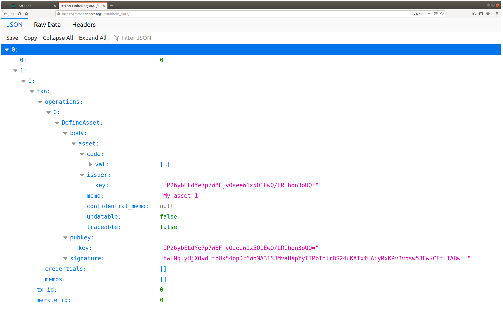

# Transaction Builder Command Line Interface

The `txn_builder_cli` application creates transactions and submits
them to the ledger server. The typical workflow is as follows
* Generate a cryptographic key pair. Just once. See `txn_builder_cli keygen`
* Create a new empty transaction. See `txn_builder_cli create`.
* Add operations to the transaction. See `txn_builder_cli add`.
* Submit the transaction to the ledger. See `txn_builder_cli submit`
  and note the transaction ID reported.
* Query the ledger with the transaction ID to see if the transaction
  was committed using a web browser or command line tool.

## Command help

To get documentation on a specific command, use the keyword help
followed by the the command. To get help on a subcommand, use help and
the command and subcommand.

For example, for help defining an asset

```
./txn_builder_cli help add define_asset
```

_**Note**: Even if the subcommand is unique, it is still necessary to
supply the command name as well. This is true for both help and the
actual subcommands._

## Generating cryptographic keys

Before you can create a transaction, you need a public/private key
pair. The `txn_builder_cli keygen` command will generate and save a
key pair. Note, you only need to do this one time.

## Composing a transaction

To compose a transaction, first create an empty transaction
```
$ ./txn_builder_cli create
[2020-01-29T00:33:36Z TRACE txn_builder_cli] Next path for "/home/alex/.findora/current.txn" is "/home/alex/.findora/current.txn.1"

```
Then add operations to the transaction. Three operation can be added
* Define a new asset. See `txn_builder_cli add define_asset`.
* Issue units of an asset. See `txn_builder_cli add issue_asset`.
* Transfer units of an asset. See `txn_builder_cli add transfer_asset`.

## Querying the ledger server

The ledger server provides a [RESTful
API](https://en.wikipedia.org/wiki/Representational_state_transfer)
that can be accessed by a web browser or command line tool for making
web requests such as `wget` or `curl`.

```
$ curl https://testnet.findora.org:8669/txn_status/4977619fd7c7dd1c6b917ced37abc718e815a71b3488ece555c8b022286c6974
{"Committed":[0,[]]}
```

### Listing blocks

It is possible to list all the transaction blocks since a given transaction serial number.

```
$ curl https://testnet.findora.org:8668/blocks_since/0
[[0,[{"txn":{"operations":[{"DefineAsset":{"body":{"asset":{"code":{"val":[241,87,161,27,80,75,66,213,73,161,157,52,166,158,219,106]},"issuer":{"key":"IP26ybELdYe7p7W8FjvOaeeW1x5O1EwQ/LRIhon3oUQ="},"memo":"My asset 1","confidential_memo":null,"updatable":false,"traceable":false}},"pubkey":{"key":"IP26ybELdYe7p7W8FjvOaeeW1x5O1EwQ/LRIhon3oUQ="},"signature":"hwLNqlyHjXOvdHtbUx54bpDr6WhMA31SJMvaUXpYyTTPbInlrBS24uKATxfUAiyRxKRv3vhsw5JFwKCFtLIABw=="}}],"credentials":[],"memos":[]},"tx_id":0,"merkle_id":0}]]]
```

This looks nicer in a web browser that formats JSON nicely such as Firefox.



