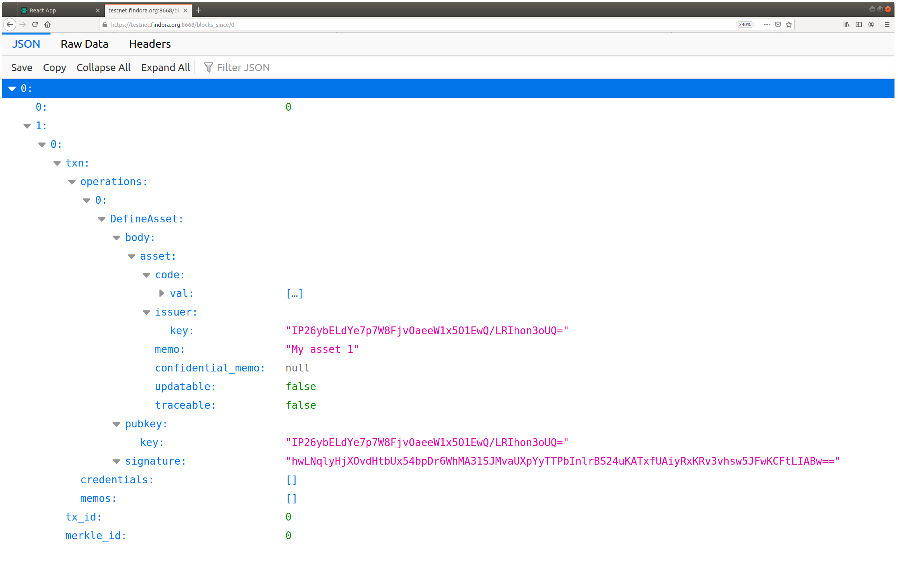
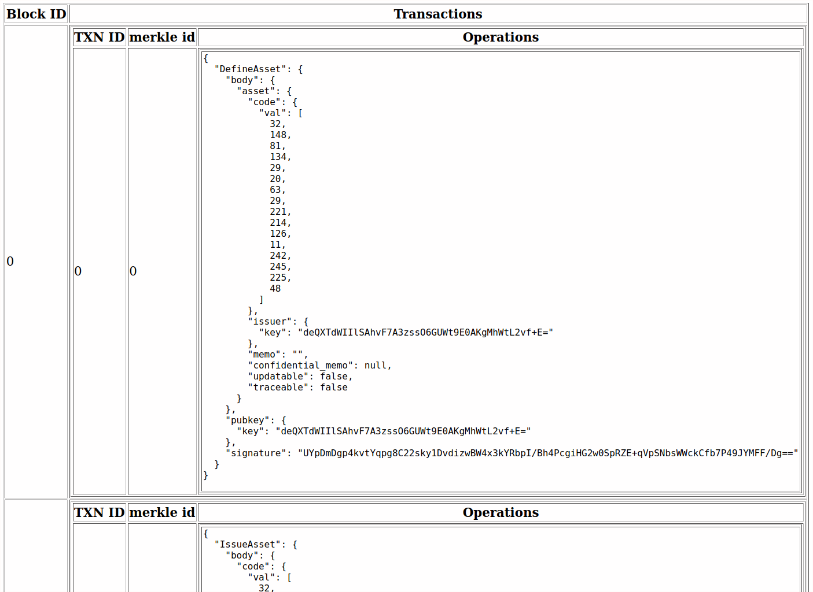

# Transaction Builder Command Line Interface
1. [Overview](#overview)
2. [Example of confidential transfer](#example-of-confidential-transfer)
3. [Commands](#commands)
   1. [Asset Issuer](#asset-issuer)
       * [Asset Issuer sign up](#asset-issuer-sign-up)
       * [Asset definition](#define-an-asset)
       * [Asset issuance](#issue-units-of-an-asset)
       * [Asset transfer](#transfer-units-of-an-asset)
       * [Asset issue and transfer](#issue-and-transfer-units-of-an-asset)
       * [Store sids](#store-sids-to-file)
   2. [Credential Issuer](#credential-issuer)
       * [Credential Issuer sign up](#credential-issuer-sign-up)
   3. [Borrower](#borrower)
       * [Borrower sign up](#borrower-sign-up)
       * [Borrower requests a loan](#request-a-loan)
       * [Borrower load funds](#borrower-load-funds)
       * [Borrower view loans](#borrower-view-loans)
       * [Borrower add or update credential record](#create-or-overwrite-a-credential)
       * [Borrower get asset record](#get-asset-record)
   4. [Lender](#lender)
       * [Lender sign up](#sign-up-a-lender-account)
       * [Lender fulfills the loan](#fulfill-a-loan)
       * [Lender view all loans](#view-all-loans) 
       * [Lender view a specific loan](#view-a-specific-loan)
4. [Querying the ledger server](#querying-the-ledger-server)

## Overview
The `txn_cli` application is intended to help one experiment with the
RESTful API and access the Ledger from scripts. It provides a command
line interface for constructing and submitting a `transaction` to the
Ledger. Each `transaction` contains a sequence of operations which
will be performed on the ledger.

Transactions are built by first creating an empty transaction with
`txn_cli create_txn_builder --name <filename>`, and then filling the
newly created transaction with operations. In the following, we'll
typically add just one operation to the transaction. Once completed,
the transaction is then submitted to the testnet ledger
`https://testnet.findora.org`, with

```
txn_cli --txn <filename> submit
```
or to the standalone ledger at `http://localhost` with
```
txn_cli --local --txn <filename> submit
```

There are four User roles available; and each has an associated
`sign_up` command in `txn_cli`, which adds an entry to a JSON file
~/.findora/data.json.
1. Asset Issuer
2. Credential Issuer
3. Borrower
4. Lender

The Ledger supports a querying with the transaction ID to see if the transaction was committed using a web browser or command line tool.

## Command help

To get documentation on a specific command, use the keyword help
followed by the command. To get help on a subcommand, use help and
the command and subcommand.

For example, for help defining an asset

```
txn_cli asset_issuer define_asset --help
```

**Note**:
* Even if the subcommand is unique, it is still necessary to supply
  the command name as well. This is true for both help and the actual
  subcommands.
* By default, all the generated files will be stored in `~./findora`,
  unless specified otherwise. For example, if the current directory is
  `platform/target/debug`, running `txn_cli keygen` will put the
  generated key pair in ~./findora, but `txn_cli keygen --name
  keys/key_pair` will store the key pair to `$PWD/keys/key_pair`.
* Examples below are assuming that `txn_cli` is in the `$PATH`.
  Typically it resides in either `platform/target/debug` or
  `platform/target/release`.

## Example of confidential transfer

The following commands are meant to be executed in order by you the user.

We assume that the file `~/.findora/data.json` is the same as `init_data.json` in this directory.

## Sign up an asset issuer account for Ian
```
txn_cli asset_issuer sign_up --name Ian
```
Note from the output that Ian's id is `1`: 
```
Ian's id is 1.
```

## Sign up a borrower account for Bill
```
txn_cli borrower sign_up --name Bill
```
Note from the output that Bill's id is `1`:
```
Bill's id is 1.
```

## Ian: defines an asset
### Create an empty transaction
```
txn_cli create_txn_builder --name txn_define
```

### Define an asset
```
txn_cli --txn txn_define asset_issuer --id 1 define_asset --memo 'Define an asset.'
```
Note from the output that the asset token code is `7hAA3TTJQHhDGs-_mpP12Q==`, or `[238, 16, 0, 221, 52, 201, 64, 120, 67, 26, 207, 191, 154, 147, 245, 217]`:
```
Creating asset with token code "7hAA3TTJQHhDGs-_mpP12Q==": [238, 16, 0, 221, 52, 201, 64, 120, 67, 26, 207, 191, 154, 147, 245, 217]
```

### Submit the transaction
```
txn_cli --txn txn_define submit
```

## Ian: issues and transfers the asset confidentially to Bill
### Create an empty transaction
```
txn_cli create_txn_builder --name txn_issue_and_transfer
```

### Issue and transfer the asset (FIXME: Is there supposed to be a memo_file? This command doesn't take one!)
```
txn_cli --txn txn_issue_and_transfer asset_issuer --id 1 issue_and_transfer_asset --recipient 1 --amount 100 --token_code 7hAA3TTJQHhDGs-_mpP12Q== --confidential_amount
```

### Submit the transaction and get the utxo
```
txn_cli --txn txn_issue_and_transfer submit --get_sids
```
Note from the last line of the output that the utxo is `429`:
```
Utxo: [TxoSID(429)]
```

## Trace and verify the asset
### Bill: verifies the received asset (FIXME: Expected a memo_file, error if none)
```
txn_cli borrower --id 1 get_asset_record --sid 429 --memo_file memo
```
Note from the last line of the output that the asset token code is indeed `[238, 16, 0, 221, 52, 201, 64, 120, 67, 26, 207, 191, 154, 147, 245, 217]`, and the amount Bill owns is `100`.
```
Bill owns 100 of asset [238, 16, 0, 221, 52, 201, 64, 120, 67, 26, 207, 191, 154, 147, 245, 217].
```

### Ian: traces the asset transferred to Bill and verifies the amount
```
txn_cli asset_issuer --id 1 trace_and_verify_asset --memo_file memo --expected_amount 100
```

## Commands
### Asset Issuer
#### Asset Issuer sign up
In the initial data, there's one asset issuer, Izzie, with *id* = 0. If you wish to sign up (create) a new asset issuer account, you'd 
do:
```
txn_cli asset_issuer sign_up --name 'AssetIssuer' (FIXME 01: Doesn't create file if ~/.findora/data.json does not exist)
```

#### Define an asset
1) Create an empty transaction
```
txn_cli create_txn_builder --name txn_define
```
2) Define an asset
```
txn_cli --txn txn_define asset_issuer --id 0 define_asset --memo 'Define an asset.'
```
In your output you should see a line like
```
yourname@yourhost: Creating asset with token code "KgiiRiHhkYdZ6FLFmM6FrQ==": [42, 8, 162, 70, 33, 225, 145, 135, 89, 232, 82, 197, 152, 206, 133, 173]
```

Save this token code for later use. By default, a randomly generated token code will be used.

If you wish to have `txn_cli` use a user supplied token code, use the `--token_code <token_code>` argument.

```
txn_cli --txn txn_define asset_issuer --id 0 define_asset --memo 'Define an asset.' --token_code 23
```

(FIXME 02: supplying `token_code` breaks the `define_asset` call)

To define a fiat asset, add `--fiat`.
To allow update or tracing, add `--updatable` or `--traceable`, respectively.

3) Submit the transaction
```
txn_cli --txn txn_define submit
```

#### Issue units of an asset
After an asset is defined and the transaction is submitted:
1) Create another empty transaction
```
txn_cli create_txn_builder --name txn_issue
```
2) Issue the asset 
```
txn_cli --txn txn_issue asset_issuer --id 0 issue_asset --token_code <token_code> --amount 100
```
To make the token amount confidential, add `--confidential_amount`.
3) Submit the transaction
```
txn_cli --txn txn_issue submit
```
To display the utxo sids, add `--get_sids`. To store the sids to a file, use `--sids_file`.
```
txn_cli --txn txn_issue submit --get_sids --sids_file sids_file
```

#### Transfer units of an asset
After an asset is defined and issued, transactions are submitted, and utxo sids are stored:
1) Create an empty transaction
```
txn_cli create_txn_builder --name txn_transfer
```
2) Transfer 
After blind asset record and associated memos are stored:
```
txn_cli --txn txn_transfer asset_issuer --id 0 transfer_asset --sids_file sids_file --recipients 0,1 --issuance_txn_files txn_issue --input_amounts 45 --output_amounts 10,35
```
(FIXME 03: thread 'main' panicked at 'index out of bounds: the len is 1 but the index is 1', components/txn_cli/src/data_lib.rs:486:25)

3) Submit the transaction
```
txn_cli --txn txn_transfer submit
```

#### Issue and transfer units of an asset
After an asset is defined and the transaction is submitted:
1) Create an empty transaction
```
txn_cli create_txn_builder --name txn_issue_and_transfer
```
2) Issue and transfer the asset
```
txn_cli --txn txn_issue_and_transfer asset_issuer --id 0 issue_and_transfer_asset --recipient 0 --amount 1000 --token_code 23
```
To make the token amount confidential, add `--confidential_amount`.

3) Submit the transaction
```
txn_cli --txn txn_issue_and_transfer submit
```
To get the utxo sids, add `--get_sids`.

#### Store sids to file
If only one utxo sid is needed for an asset transfer, there's no need
to use the `store_sids` subcommand. When submitting the asset issuing
transaction, simply use `--sids_file` to specify a file to store the
utxo sid.

Otherwise, add `--get_sids` when submitting asset issuing transactions, and note the utxo sids shown in the outputs. After all the transactions needed are submitted, store all the utxo sids to one file:
```
txn_cli asset_issuer store_sids --file sids_file --indices 1,2,3
```

#### Store asset tracer memo and owner memo (FIXME 04: No file, no error message)
Asset tracer memo and owner memo are necessary for asset tracing. To store them:
```
txn_cli asset_issuer --id 0 store_memos --file memo_file --amount 100 --token_code <token_code>
```
For confidential token amount, add `--confidential_amount`.

#### Trace and verify an asset
After the asset tracer memo and owner memo are stored by `store_memos` or `issue_and_transfer_asset --memo_file`, trace the asset and verify the token amount.
```
txn_cli asset_issuer --id 0 trace_and_verify_asset --memo_file memos --expected_amount 50
```

### Credential issuer
Currently, the credential is fixed, with three attributes
* `min_credit_score`
* `max_credit_score`
* `citizenship`

#### Sign up a credential issuer account
In the initial data, there's one credential issuer, Ivy. To sign up a new credential issuer account:
```
txn_cli credential_issuer sign_up --name 'Issuer Name'
```

### Lender
#### Sign up a lender account
In the initial data, there are two issuers, Lenny and Luna. To sign up a new lender account:
```
txn_cli lender sign_up --name 'Lender Name'
```
#### Fulfill a loan
* Create an empty transaction
```
txn_cli create_txn_builder --name txn_fulfill
```
* Fulfill the loan
```
txn_cli --txn txn_fulfill lender --id 0 fulfill_loan --loan 0 --issuer 0
```

#### View all loans
* View all loans of a lender
```
txn_cli lender --id 0 view_loan
```
#### View a specific loan
* View a specific loan
```
txn_cli lender --id 0 view_loan --loan 0
```
Make sure the specified loan is owned by the lender.
* View loans with a filter
To filter the loans, add `--filter` with one of the following:
  * `requested`: loans that have been requested but not fulfilled
  * `fulfilled`: loans that have been fulfilled, either paid off or not
  * `declined`: loans that have been declined
  * `active`: loans that have been fulfilled but not paid off
  * `complete`: Loans that have been paid off
For example:
```
txn_cli lender --id 0 view_loan --filter active
```

#### Create or overwrite credential requirement
Currently supported attributes are min_credit_score, min_income and citizenship.
For example, to create a requirement on min_credit_score:
```
txn_cli lender --id 0 create_or_overwrite_requirement --attribute min_credit_score --requirement 650
```
If the requirement already exists, the previous value will be overwritten.

### Borrower
#### Borrower sign up
In the initial data, there's one borrower, Ben. To sign up a new borrower account:
```
txn_cli borrower sign_up --name 'Borrower Name'
```

#### Request a loan
```
txn_cli borrower --id 0 request_loan --lender 0 --amount 500 --interest_per_mille 80 --duration 5
```

#### Borrower load funds
* Create an empty transaction
```
txn_cli create_txn_builder --name txn_load
```
* Load funds
```
txn_cli --txn txn_load borrower --id 0 load_funds --issuer 0 --amount 500
```
To store the asset tracer memo and owner memo, use `--memo_file`.

#### Borrower view loans
* View all loans of a borrower
```
txn_cli borrower --id 0 view_loan
```
* View a specific loan
```
txn_cli borrower --id 0 view_loan --loan 0
```
Make sure the specified loan is owned by the borrower.
* View loans with a filter
To filter the loans, add `--filter` with one of the following:
  * `requested`: loans that have been requested but not fulfilled
  * `fulfilled`: loans that have been fulfilled, either paid off or not
  * `declined`: loans that have been declined
  * `active`: loans that have been fulfilled but not paid off
  * `complete`: Loans that have been paid off
For example:
```
txn_cli borrower --id 0 view_loan --filter active
```

#### Pay down a loan
* Create an empty transaction
```
txn_cli create_txn_builder --name txn_pay
```
* Pay off the loan
```
txn_cli --txn txn_pay borrower --id 0 pay_loan --loan 0 --amount 200
```
By default, `https://testnet.findora.org` is used. To switch to `http://localhost`, add `--http --localhost`.

#### View credentials
```
txn_cli borrower --id 0 view_credential
```
To viea a specific credential attribute, use `--attribute`.

#### Create or overwrite a credential
Currently supported attributes are min_credit_score, min_income and citizenship.
For example, to create a min_credit_score credential:
```
txn_cli borrower --id 0 create_or_overwrite_credential --attribute min_credit_score --value 650
```
If the credential already exists, the original record will be overwritten.

#### Get asset record
After the owner memo is stored:
```
txn_cli borrower --id 0 get_asset_record --sid 1 --memo_file m_file
```
By default, `https://testnet.findora.org` is used. To switch to `http://localhost`, add `--http --localhost`.

## Querying the ledger server

The ledger server provides a [RESTful
API](https://en.wikipedia.org/wiki/Representational_state_transfer)
that can be accessed by a web browser or command line tool for making
web requests such as `wget` or `curl`.

```
$ curl https://testnet.findora.org:8669/txn_status/4977619fd7c7dd1c6b917ced37abc718e815a71b3488ece555c8b022286c6974
{"Committed":[0,[]]}
```

#### Listing blocks

It is possible to list all the transaction blocks since a given
block sequence number. The `blocks_since` route takes a
block sequence number and returns a JSON expression with all the
transactions in the blocks from the one specified by the sequence
number to the most recent block.

```
$ curl https://testnet.findora.org:8668/blocks_since/0
[[0,[{"txn":{"operations":[{"DefineAsset":{"body":{"asset":{"code":{"val":[241,87,161,27,80,75,66,213,73,161,157,52,166,158,219,106]},"issuer":{"key":"IP26ybELdYe7p7W8FjvOaeeW1x5O1EwQ/LRIhon3oUQ="},"memo":"My asset 1","confidential_memo":null,"updatable":false,"traceable":false}},"pubkey":{"key":"IP26ybELdYe7p7W8FjvOaeeW1x5O1EwQ/LRIhon3oUQ="},"signature":"hwLNqlyHjXOvdHtbUx54bpDr6WhMA31SJMvaUXpYyTTPbInlrBS24uKATxfUAiyRxKRv3vhsw5JFwKCFtLIABw=="}}],"credentials":[],"memos":[]},"tx_id":0,"merkle_id":0}]]]
```

This looks nicer in a web browser that formats JSON nicely such as Firefox.


or by using the `jq` command, as 
```
$ curl https://testnet.findora.org:8668/blocks_since/0 | jq "."
```

The `block_log` route returns all the transactions as tabular HTML.

```
$ curl https://testnet.findora.org:8669/block_log
```


