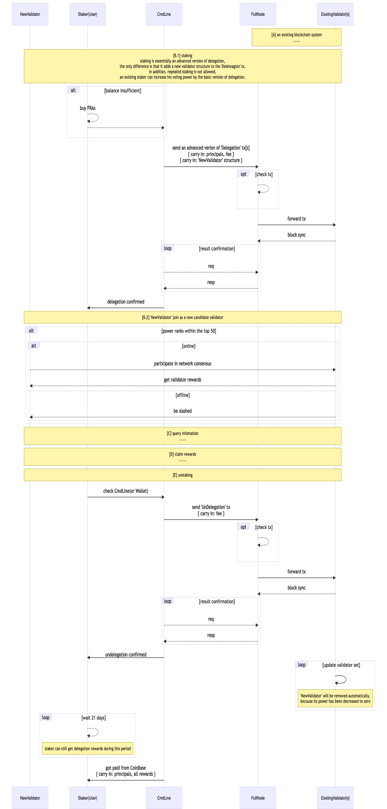

# Staking Work Flow

> For simplicity, all the flowcharts and timing diagrams in this article will not show the logics about non-essential nodes, such as SeedNode, SentryNode, etc.

## Macro View

### \<Timing Diagrams No.1\>: Delegation

### \<Timing Diagrams No.2\> Staking(delegate as a new validator)

> **NOTE**: '**......**' means that the logic there is exactly the same as the delegation process, so the related description will not be repeated.

### \<Flowchart No.1\> Deployment

- **TODO**
