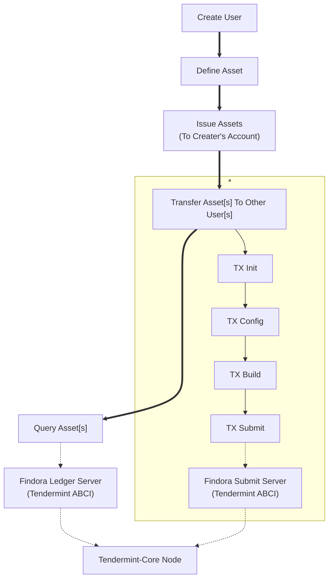
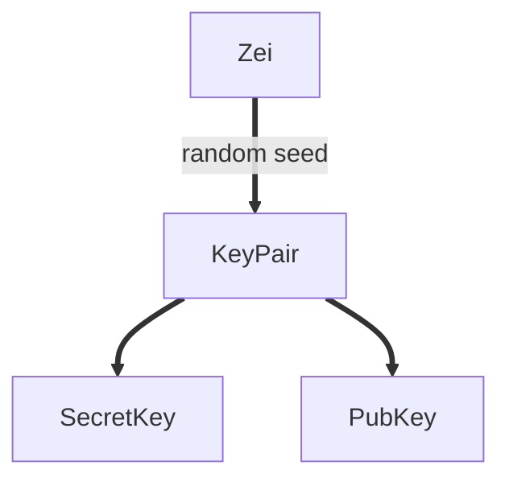

# Arch Desc

## Create A Transaction From Nil

```mermaid
graph TB
    a["Create User"] ==> b["Define Asset"]
    b ==> c["Issue Assets<br>(To Creater's Account)"]
    c ==> d["Transfer Asset[s] To Other User[s]"]

    subgraph "*"
        d --> sa["TX Init"] --> sb["TX Config"] --> sc["TX Build"] --> sd["TX Submit"]
        sd -.-> se["Findora Submit Server<br>(Tendermint ABCI)"]
    end

    d ==> e["Query Asset[s]"]
    e -.-> f["Findora Ledger Server<br>(Tendermint ABCI)"]
    f -.-> sg["Tendermint-Core Node"]
    se -.-> sg["Tendermint-Core Node"]
```

#### generate user key

```mermaid
graph TB
    Zei ==> |"random seed"|KeyPair
    KeyPair ==> SecretKey
    KeyPair ==> PubKey
```
